# ALLGANs

머신러닝 프레임워크를 활용한 비교사(Unsupervised) 학습 모델 구현 프로젝트

## Authors

- [demetoir](https://github.com/demetoir)
  - e-mail: wnsqlehlswk@naver.com
- [WKBae](https://github.com/WKBae)
  - e-mail: williambae1@gmail.com
- [StarG](https://github.com/psk7142)
  - e-mail: psk7142@naver.com

## Results

GAN, LSGAN, WGAN are have same generator and discriminator CNN structure.
training with MNIST, fashion-mnist, CIFAR10, LLD
no data augmentation

### GAN

| MNIST(20 epoch)                    | fashion-mnist(20 epoch)                    | CIFAR10(20 epoch)                    | LLD(20 epoch)                    |
| ---------------------------------- | ------------------------------------------ | ------------------------------------ | -------------------------------- |
| 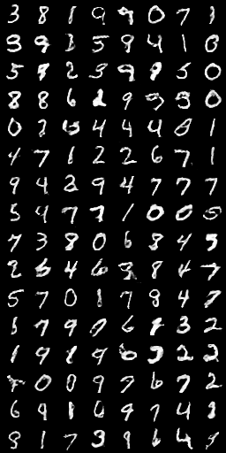 | 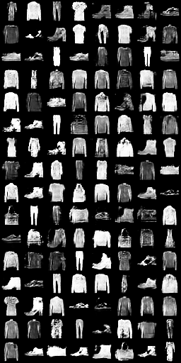 | 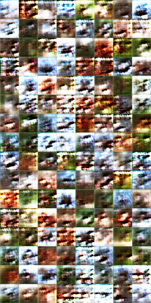 | 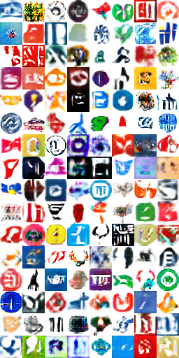 |

### LSGAN

| MNIST(20 epoch)                      | fashion-mnist(20 epoch)                      | CIFAR10(20 epoch)                      | LLD(20 epoch)                      |
| ------------------------------------ | -------------------------------------------- | -------------------------------------- | ---------------------------------- |
| 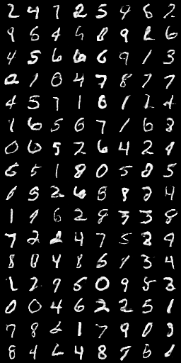 | 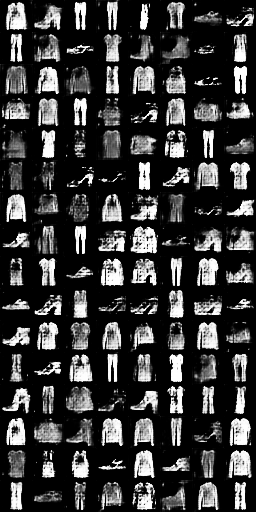 | 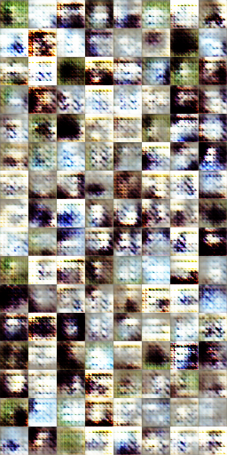 | 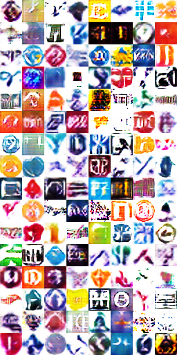 |


### WGAN

| MNIST(20 epoch)                     | fashion-mnist(20 epoch)                     | CIFAR10(20 epoch)                     | LLD(5 epoch)                               |LLD(20 epoch)                     |
| ----------------------------------- | ------------------------------------------- | ------------------------------------- | ------------------------------------------ |----------------------------------|
| 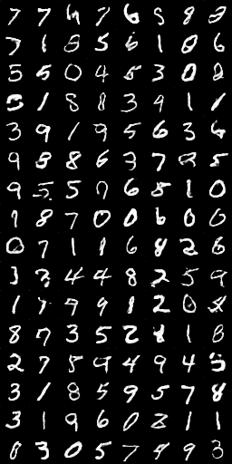 | 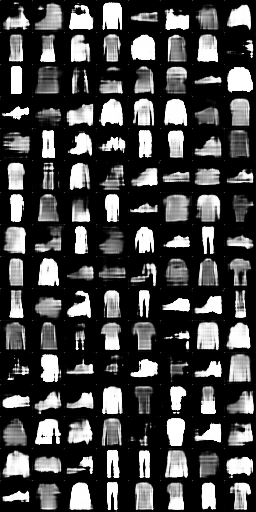 | 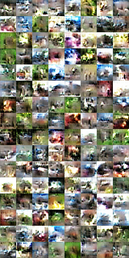 | 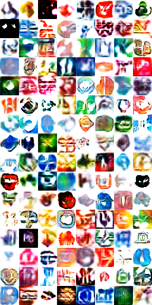| 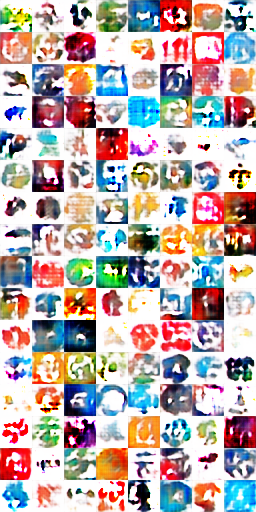|

## observation

MNIST dataset is easy for GAN, LSGAN, WGAN.

Training with fashion-mnist dataset, GAN is slightly better others.

Training with CIFAR10 dataset, WGAN are better than others. but clearly does not generate looks pretty image like original image.

Training with LLD dataset, three GANs generate similar image.
Compare with original image, three GANs generate ugly image.
Compare other GANs, WGAN generate best image in less epoch, but after 5 epoch generate worse than others.
Above loss of generator and discriminator, generator overpowered discriminator.
GANs trained outline of all original dataset(fashion-mnist, CIFAR10, LLD), but did not train detail.


## Getting Started

1. `python ./setup.py install` and follow console
2. in console `python ./main.py`

## File Tree

```terminal
├─data          # default dataset
├─data_handler
├─dict_keys
├─instance      # default model instance
├─model
├─unit_test
├─util
├─visualizer
└─workbench
```

## Dependencies

- Python 3.5+
  - matplotlib (2.1.2)
  - numpy (1.14.0)
  - pandas (0.22.0)
  - Pillow (5.0.0)
  - scikit-image (0.13.1)
  - scikit-learn (0.19.1)
  - scipy (1.0.0)
  - tensorflow (1.4.1)
  - tensorflow-gpu (1.4.1)
  - tensorflow-tensorboard (0.4.0)
  - opencv-python (3.4.0.12)
  - requests (2.18.4)

## Reference

- [Generative Adversarial Networks](https://arxiv.org/abs/1406.2661)
- [Least Squares Generative Adversarial Networks](https://arxiv.org/abs/1611.04076)
- [Wasserstein GAN](https://arxiv.org/abs/1701.07875)
- [Improved Training of Wasserstein GANs](https://arxiv.org/abs/1704.00028)
- [Going Deeper with Convolutions](https://arxiv.org/abs/1409.4842)
- [Rethinking the Inception Architecture for Computer Vision](https://arxiv.org/abs/1512.00567)
- [Inception-v4, Inception-ResNet and the Impact of Residual Connections on Learning](https://arxiv.org/abs/1602.07261)
